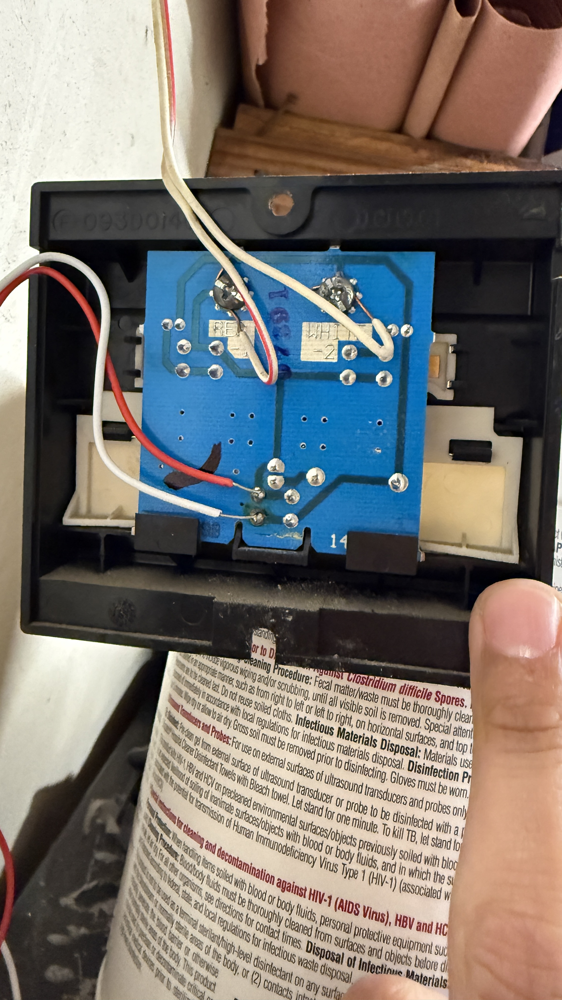
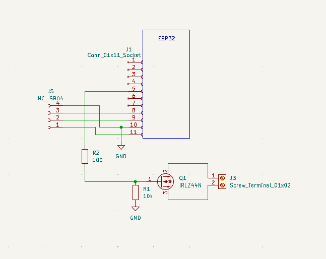

# Smart Garage Door Opener (Hardware Hack + Custom PCB)

A custom hardware interface that integrates a legacy garage door opener with ESP Home automation.  
Designed and built from scratch including schematic design, PCB layout (KiCad), and firmware.

## Demo

TODO: DEMO VIDEO

DODO: Import final PCB Photo

## Problem

My garage door opener had no remote automation capability.  
Commercial solutions were expensive and closed-source.

Goals:
- Integrate with Home Assistant
- Detect when the garage door is open/closed
- Design a test breadbaord setup
- Design a permanent PCB solution

## Hardware Design

### Original Hardware:
- Opens with a button press which is passed through a capacitor. This determins whether to open the door, turn the light on/off, or lock the garage door.
- Garage door opener controls are low voltage and do not draw alot of power

## System Architecture

### Componenets: 
- The ESP32 micrcontroller only consumes around 7W at idle and integrates seemlesly into homeassistant with custom firmware, wifi, and the ability to create custom YAML files to configure pins and button interactions on Homeassistant. 
- MOSFETs can come is very small packages and work perfectly for a voltage controled switch.